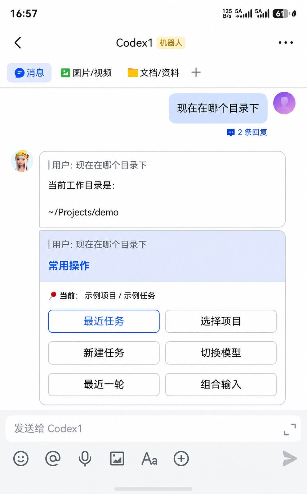

# codex-lark

<p align="center">
  <a href="https://www.npmjs.com/package/codex-lark"></a>
  <a href="https://www.npmjs.com/package/codex-lark"></a>
  <a href="LICENSE"></a>
  <a href="https://github.com/goodyorkye/codex-lark/actions/workflows/ci.yml"></a>
  <a href="https://nodejs.org"></a>
</p>

**用手机飞书，随时继续 ChatGPT / Codex Desktop 里的 Codex 任务。**

你不需要在手机上运行另一个 Agent，也不用重新描述工作背景。`codex-lark` 把 ChatGPT 或 Codex Desktop 里已有的 Codex 项目和任务带到飞书，让你离开电脑后仍能接着处理，回到电脑时又可以继续使用同一个任务。

**用飞书扫一次码，即可一键创建并绑定专属机器人。只用这一个机器人，就能管理这台电脑上 ChatGPT / Codex Desktop 里的多个 Codex 项目和任务。**

这里连接的是桌面应用里的 **Codex 项目与任务**，不是普通 ChatGPT 聊天或 ChatGPT Work 会话。

**飞书中采用卡片式按钮操作。** 最近任务、项目、模型、推理强度和组合输入都可以直接点击和切换，不用记命令，也不用反复输入名称。

[English](README.en.md) · [常见问题](docs/TROUBLESHOOTING.md) · [隐私说明](docs/PRIVACY.md)

<p align="center">
  
</p>

## 它适合什么场景

- ChatGPT / Codex Desktop 里的 Codex 正在执行任务，你想用手机查看进展或处理审批。
- 临时离开电脑后，想从飞书继续某个已有任务。
- 同时进行多个项目，希望在手机上快速切换，而不是重新建立上下文。
- 想把文字、图片、语音和文件一起交给 Codex，但不想使用远程桌面。

`codex-lark` 的重点不是“在飞书里再造一个 Codex”，而是让飞书成为 **ChatGPT / Codex Desktop 里 Codex 任务的轻量手机遥控器**。

## 手机上可以做什么

- 查看并切换电脑上的项目和任务。
- 继续已有任务，或在某个项目中快速新建任务。
- 发送文字、图片、语音和文件。
- 使用“组合输入”，把多条文字和多个附件作为同一轮内容发送。
- 查看 Codex 的实时回复和当前执行状态；回复里的图片、音频、视频和文件会在结束后作为飞书原生消息发送。
- 主动获取当前任务最近一轮记录，包括计划、工具过程以及图片、音频、视频和文件附件。
- 在手机上允许或拒绝命令执行、文件修改等权限请求。
- 选择模型和推理强度，并随时停止正在进行的任务。

项目、任务、模型和常用操作都通过飞书卡片完成。你可以在多个项目和任务之间快速来回切换；日常使用直接点按钮或发送消息即可，不需要记命令。

## 三步开始使用

准备好：

- Node.js 20.12 或更高版本
- 已登录的官方 ChatGPT 或 Codex Desktop
  - macOS：ChatGPT 或 Codex Desktop
  - Windows：从 Microsoft Store 安装的 Codex Desktop
- 手机飞书或 Lark

### 1. 打开电脑上的 ChatGPT 或 Codex Desktop

确认它已经登录并能正常使用。

### 2. 在电脑终端运行

```bash
npx -y codex-lark@latest
```

### 3. 用飞书扫描二维码

第一次运行时，终端会显示二维码。扫码完成后，飞书助手会主动发来常用操作卡片，直接点击就可以开始。

就这些。无需安装 Codex CLI，无需填写 OpenAI API Key，无需进入飞书开发者后台配置机器人，也不会打开浏览器或要求公网服务器。

以后再次使用，只要运行同一条命令即可；已有配置会自动保留，不需要重复扫码。

## 日常使用

保持终端窗口打开，然后在飞书中：

1. 从“最近任务”或“项目列表”选择要继续的工作。
2. 像普通聊天一样发送消息。
3. 需要一起发送文字和附件时，点击“组合输入”。
4. Codex 请求权限时，直接在审批卡片中选择是否允许。
5. 需要回到电脑时，打开 ChatGPT / Codex Desktop 中的同一个 Codex 任务继续即可。

按 `Ctrl+C` 可以停止程序；关闭终端也会断开手机连接，但不会删除 Codex 任务或飞书配置。

## 主动推送任务结果

完成首次扫码配置后，可以从终端把任务结果直接推送给当前 profile 的飞书应用所有者。默认消息是一张结果卡片，显示推送内容、profile、项目和 Codex 会话来源。发送本身通过飞书 REST API 完成，不要求 bridge 正在运行：

```bash
npx --yes codex-lark@latest notify "构建和测试均已通过。" \
  --title "任务完成"
```

发送 Markdown 结果及产物：

```bash
npx --yes codex-lark@latest notify \
  --title "报告生成完成" \
  --markdown-file /absolute/path/result.md \
  --cwd /absolute/path/to/workspace \
  --file /absolute/path/report.pdf
```

在 Codex 任务中调用时，命令会从 `CODEX_THREAD_ID` 自动识别当前会话，并在卡片上显示“继续此会话”和“查看详情”按钮；也可以用 `--thread <id>` 显式指定。按钮点击时需要 `codex-lark` bridge 正在运行，以便接收飞书回调并切换到对应会话。若只需要旧式 Markdown 消息，可添加 `--plain`。

可以重复使用 `--file`。Markdown 中引用的本地图片、音频、视频和文件也会作为飞书原生资源消息发送。使用 `--to <open_id|chat_id>` 可以显式指定其他接收人或群聊；未指定时默认发送给应用所有者。

`codex-lark` 启动时会把内置的 [`codex-lark-notify` 技能](skills/codex-lark-notify/SKILL.md)自动安装到 `~/.agents/skills`，Codex 随后就能在用户明确提出“完成后推送给我”“把结果发到飞书”等要求时调用该命令。自动更新不会覆盖用户修改或同名的非托管技能；可以用 `codex-lark skill status` 查看状态，或用 `codex-lark skill install` 手动重试。技能只负责即时发送，不包含离线队列或自动完成 hook。

## 为什么用起来没有压力

- **沿用 Desktop 上下文**：手机和电脑继续的是同一项工作。
- **不安装另一套 Codex**：直接使用官方 ChatGPT / Codex Desktop 已有的登录和任务。
- **扫码即用**：机器人创建和连接由程序完成。
- **一个机器人管理全部工作**：不需要为每个项目或任务分别创建机器人。
- **卡片按钮，点击即切换**：项目、任务、模型、推理强度和组合输入都不需要记命令。
- **数据留在本机**：本地配置和临时附件保存在电脑上，敏感日志会脱敏。
- **同时支持 macOS 和 Windows**：Desktop 升级后，重启 `codex-lark` 即会重新识别当前版本。

## 使用须知

- 电脑需要保持开机，终端需要保持运行。
- 电脑需要能够正常访问 OpenAI 和飞书/Lark。
- Windows 请使用 Microsoft Store 安装的官方 Codex Desktop。
- Desktop 的部分本机交互能力可能随官方版本变化；遇到问题请查看[常见问题](docs/TROUBLESHOOTING.md)。

## 更多资料

- [常见问题](docs/TROUBLESHOOTING.md)
- [隐私说明](docs/PRIVACY.md)
- [安全说明](SECURITY.md)
- [开发与贡献](docs/DEVELOPMENT.md)
- [技术架构](docs/ARCHITECTURE.md)

项目使用 MIT 许可证。本项目不隶属于 OpenAI、飞书、字节跳动或 Remodex，也未获得这些项目的官方背书。第三方代码来源见 [NOTICE](NOTICE) 和 [THIRD_PARTY_NOTICES.md](THIRD_PARTY_NOTICES.md)。

## 参考项目

- [Lark Channel Bridge](https://github.com/zarazhangrui/lark-coding-agent-bridge)
- [Remodex](https://github.com/Emanuele-web04/remodex)
